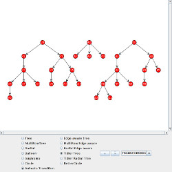
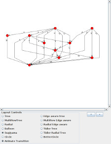
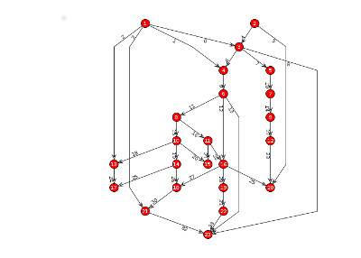
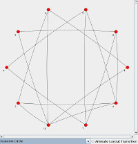
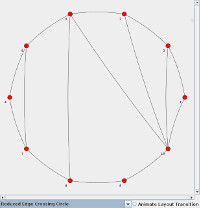

## JUNGRAPHT-VISUALIZATION: The [JUNG](http://jung.sourceforge.net) visualization and sample code modernized and ported to use [JGraphT](https://jgrapht.org) graphs and algorithms

[](https://travis-ci.org/tomnelson/jungrapht-visualization)
[](https://maven-badges.herokuapp.com/maven-central/com.github.tomnelson/jungrapht-visualization)
[](https://oss.sonatype.org/content/repositories/snapshots/com/github/tomnelson/jungrapht-visualization/)
[](http://www.opensource.org/licenses/BSD-3-Clause)
[](https://www.java.com/)


[**JUNGRAPHT-VISUALIZATION Website**](http://tomnelson.github.io/jungrapht-visualization/)

JUNGRAPHT-VISUALIZATION can be used to render any of the following:
* org.jgrapht.Graph
* com.google.common.graph.Network
* com.google.common.graph.Graph

JUNGRAPHT-VISUALIZATION includes performance enhancements for visualization of large networks, including R*Tree for visualization, Barnes-Hut Quad Tree for force-directed layouts, and a lightweight rendering layer that can swap in while graphs are being animated or when they are zoomed out to a point where details are very small.
In the **ShowLayoutsWithJGraptIO** demonstration program, the lightweight rendering layer allows fast enough rendering that the performance impact of the Barnes Hut Quad Tree for the force directed layout becomes obvious.

Many rendering features may be set via java properties (see [sample.jungrapht.properties](https://github.com/tomnelson/jungrapht-visualization/blob/master/jungrapht-visualization/src/main/resources/sample.jungrapht.properties) for keys and default values). 

JUNGRAPHT-VISUALIZATION includes the jungrapht-layout module, which is independent of any java.awt imports (so that it may be more easily used by JavaFX or other rendering systems). Jungrapht-layout includes improved layout algorithms for directed graphs and Trees, including the 
TidierTreeLayoutAlgorithm and the SugiyamaLayoutAlgorithm. All TreeLayoutAlgorithms will make a best attempt to draw any directed graph 
(by ignoring cycles and reversing feedback edges) for which one or more Root vertices can be determined. 
Any TreeLayoutAlgorithm, when given an undirected graph, will create a SpanningTree in order to use the TreeLayoutAlgorithm.
There are Vertex/Edge Predicates and Vertex/Edge Comparators that are used to coerce out the desired tree structure based on a user-defined procedure to find roots and follow the desired path. 
All TreeLayoutAlgorithms, including the TidierTreeLayoutAlgorithm, will draw either single or multiple rooted 'forest' graphs. CircleLayout has been improved with an option to reduce edge crossing.

JUNGRAPHT-VISUALIZATION Design and Features:

[LayoutAlgorithm and LayoutModel](LayoutAlgorithms_and_LayoutModel.md)

[MouseGestures](MouseGestures.md)

Graph using TidierTreeLayoutAlgorithm



Graph using SugiyamaLayoutAlgorithm



Graph using Eiglsperger Optimization of SugiyamaLayoutAlgorithm



Graph using CircleLayoutAlgorithm



Same graph using CircleLayoutAlgorithm with reduced edge crossing



### Latest Release


The most recent version of JUNGRAPHT-VISUALIZATION is [version 1.2](https://github.com/tomnelson/jungrapht-visualization/releases/tag/v1.2), released 25 February 2021.
*   [Javadoc](http://tomnelson.github.io/jungrapht-visualization/javadoc/index.html)
*   [Maven Search Repository](http://search.maven.org/#search%7Cga%7C1%7Cg%3A%22com.github.tomnelson%22%20AND%20v%3A%221.2%22%20AND%20(a%3A%22jungrapht-visualization%22%20OR%20a%3A%22jungrapht-visualization-samples%22))
    *   `jungrapht-visualization`: [jar](http://search.maven.org/remotecontent?filepath=com/github/tomnelson/jungrapht-visualization/1.2/jungrapht-visualization-1.2.jar), [source jar](http://search.maven.org/remotecontent?filepath=com/github/tomnelson/jungrapht-visualization/1.2/jungrapht-visualization-1.2-sources.jar), [documentation jar](http://search.maven.org/remotecontent?filepath=com/github/tomnelson/jungrapht-visualization/1.2/jungrapht-visualization-1.2-javadoc.jar)
    *   `jungrapht-layout`: [jar](http://search.maven.org/remotecontent?filepath=com/github/tomnelson/jungrapht-layout/1.2/jungrapht-layout-1.2.jar), [source jar](http://search.maven.org/remotecontent?filepath=com/github/tomnelson/jungrapht-layout/1.2/jungrapht-layout-1.2-sources.jar), [documentation jar](http://search.maven.org/remotecontent?filepath=com/github/tomnelson/jungrapht-layout/1.2/jungrapht-layout-1.2-javadoc.jar)
    *   `jungrapht-visualization-samples`: [jar](http://search.maven.org/remotecontent?filepath=com/github/tomnelson/jungrapht-visualization-samples/1.2/jungrapht-visualization-samples-1.2.jar), [source jar](http://search.maven.org/remotecontent?filepath=com/github/tomnelson/jungrapht-visualization-samples/1.2/jungrapht-visualization-samples-1.2-sources.jar), [documentation jar](http://search.maven.org/remotecontent?filepath=com/github/tomnelson/jungrapht-visualization-samples/1.2/jungrapht-visualization-samples-1.2-javadoc.jar)

To add a dependency on this release of JUNGRAPHT-VISUALIZATION using Maven, use the following:

```xml
<dependency>
  <groupId>com.github.tomnelson</groupId>
  <artifactId>jungrapht-visualization</artifactId>
  <version>1.2</version>
</dependency>
```

### Snapshots

Snapshots of JUNGRAPHT-VISUALIZATION built from the `master` branch are available through Maven using version `1.3-SNAPSHOT`.

### Links

* [GitHub project](https://github.com/tomnelson/jungrapht-visualization)
* [Issue tracker: report a defect or make a feature request](https://github.com/tomnelson/jungrapht-visualization/issues/new)
* [StackOverflow: Ask questions](https://stackoverflow.com/questions/ask?tags=jungrapht+java)

